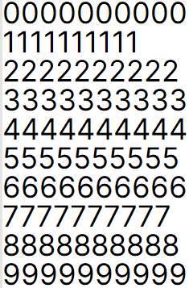
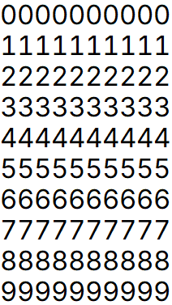

# HibizukaiSans

HibizukaiSans は [BIZ UDPゴシック](https://github.com/googlefonts/morisawa-biz-ud-gothic) と
[Inter](https://github.com/rsms/inter) の合成フォントです。
[BIZTER](https://github.com/yuru7/BIZTER) を参考にして作成されています。

## BIZTER との違い

Inter では proportional numerals グリフが採用されているため、数字を複数行にわたって並べると、位置が縦方向に揃いません。
BIZTER にはこの特徴が引き継がれています。HibizukaiSans では Inter に収容されている tabular numerals グリフを採用する
ことで、複数行の数字の位置が縦方向に揃うようにしました。

| BIZTER                                   | HibizukaiSans                                          |
|:----------------------------------------:|:------------------------------------------------------:|
|  |  |
